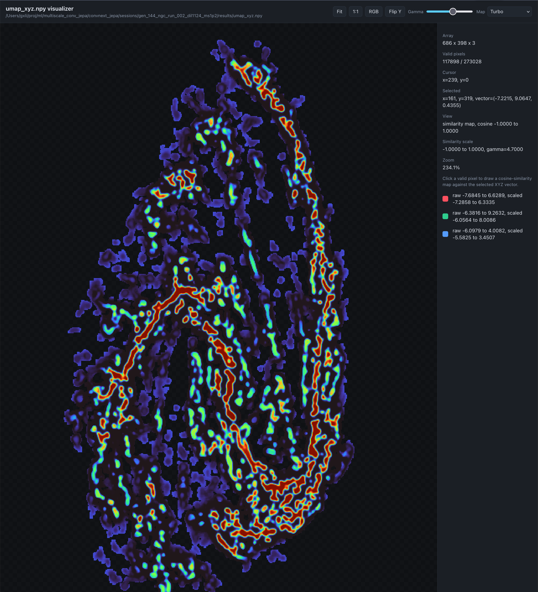
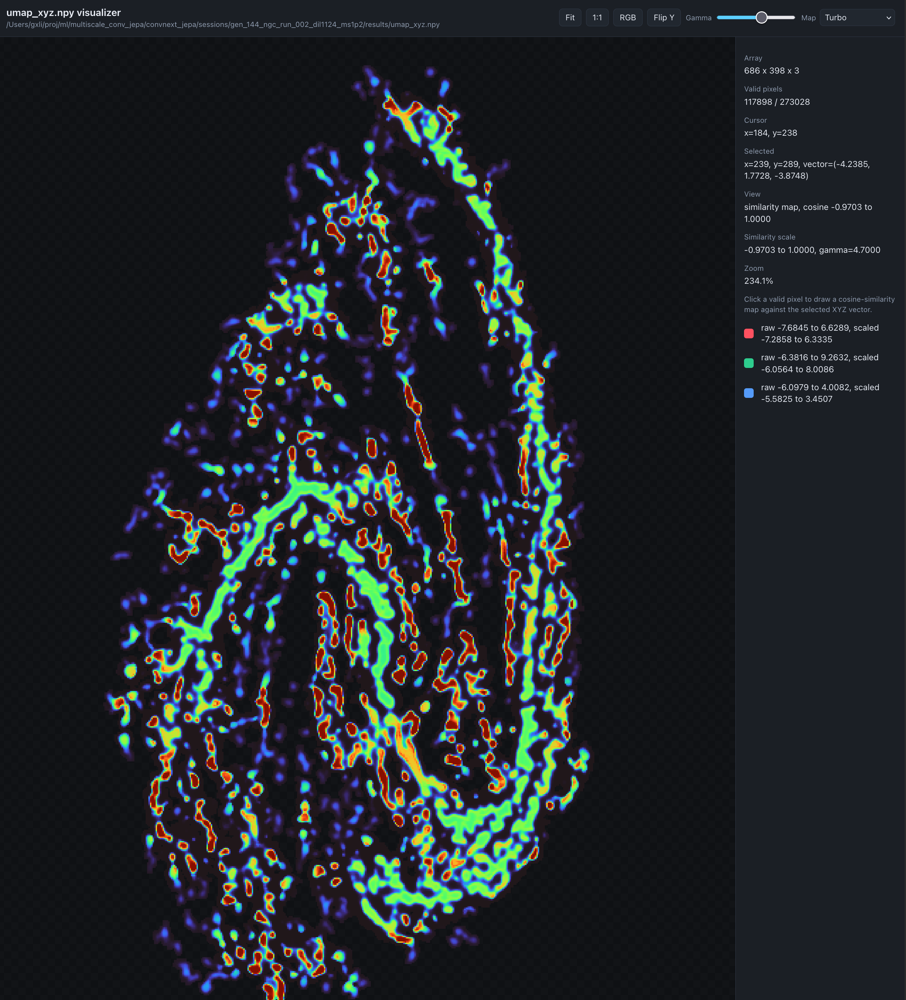

# `sajepa` — ScaleAware JEPA for Continuous Physical Fields

[](https://opensource.org/licenses/MIT)
[](https://www.python.org/)
[](https://pytorch.org/)

`sajepa` is a PyTorch implementation of **ScaleAware JEPA**, a non-generative,
self-supervised method for constructing dense, label-free, spatially
back-mappable latent coordinates for continuous two-dimensional scalar fields.

## 🏛️ Design & Features

ScaleAware JEPA replaces pixel-reconstruction architectures with dual-branch
joint-embedding predictions optimized for continuous structures:

- **ScaleAware Processing:** Constrained Diffusion Decomposition (CDD)
  decomposes an input field into aligned fine-to-coarse components.  The
  encoder receives these components alongside scale-aware masks, meaning
  the context available for prediction dynamically scales with the hidden
  target structure.
- **JEPA Latent Prediction:** An online encoder processes a masked field
  and predicts the latent representation produced by an Exponential Moving
  Average (EMA) target encoder from the corresponding unmasked field.
  Training matches latent representations at hidden target locations instead
  of reconstructing noisy pixels.
- **Dense Latent Exploration:** Every pixel receives a distinct latent
  coordinate that maps back directly to the original field coordinate space.
- **Modality Support:** 2D fields are fully supported and tested. 3D
  volumetric training (`3d_slab`) is under active development; full-volume
  inference-only mode is also available.

## 🎯 Application Scenarios

`sajepa` is explicitly engineered for label-free representation learning of
continuous 2D (and, under development, 3D) scalar fields where distinct
objects, semantic boundaries, or segmentation rules are not known in advance.

**Standard Discovery Workflow**

1. Train on raw scalar fields without human annotations or discrete tokens.
2. Extract the dense, pixel-registered latent representation space.
3. Inspect latent cluster neighborhoods globally using integrated PCA or UMAP tools.
4. Back-map selected latent neighborhoods to the original raw arrays to examine physical morphology.

**Ideal Use Cases:** Magnetohydrodynamic (MHD) turbulence maps, astronomical
intensity/molecular-gas fields, nighttime-light rasters, or any continuous
physical distribution featuring diffuse filaments, ridges, and complex compact
structures.

### 🌌 Dense Latent Atlas Projections

To verify that the scale-aware joint-embedding representations capture coherent
physical structures without manual labels, the dense 32-channel latent
coordinates are projected into a low-dimensional UMAP space. When back-mapped to
physical coordinates, these spaces organize continuous fields by their local
structural morphology.

| MHD Turbulence | NGC 3627 |
|:---:|:---:|
|  |  |
| UMAP and PCA projections for a continuous MHD plasma simulation. | UMAP and PCA projections for the molecular gas intensity field of NGC 3627. Latent neighborhoods map onto spiral structure and diffuse halo regions. |

#### 🖥️ Interactive Dashboard — NGC 3627

Click-to-similarity inspection of spiral arm and interarm regions. Selecting a
latent neighborhood in the UMAP view back-maps to the corresponding physical
structure in the galaxy field.

```python
model.open_interactive_umap()                             # generates + opens in browser
model.save_interactive_umap("predict_umap_xyz.npy", "out.html")  # save to file
```

| Spiral Arm | Interarm |
|:---:|:---:|
|  |  |

## ⚡ Installation

```bash
git clone https://github.com/gxli/SA-JEPA.git
cd sajepa
pip install -e .
```

**Apple Silicon (MPS) Note:** If you encounter missing operations on Apple GPUs
(such as a CDD operation utilizing `avg_pool3d`), configure your environment to
use the native PyTorch fallback engine:

```bash
export PYTORCH_ENABLE_MPS_FALLBACK=1
```

## 🚀 Quick Start

### 🐍 Python API

```python
import numpy as np
import torch
from sajepa import ScaleAwareJEPA

# 1. Load any 2D scalar field (H, W)
field = torch.from_numpy(np.load("path/to/your_field.npy"))

# 2. Train a default scale-aware model
model = ScaleAwareJEPA()
model.fit(field, epochs=10, session_dir="outputs/my_run")

# 3. Extract the dense latent atlas → shape (C_latent, H, W)
latent = model.extract(field)

# 4. Generate dashboards
model.generate_dashboard()                # → outputs/my_run/dashboard.html
umap_html = model.open_interactive_umap() # → outputs/my_run/results/interactive_umap_predict.html

# 5. Save everything
model.save_session("outputs/my_run")

print(f"Dashboard:     outputs/my_run/dashboard.html")
print(f"Interactive:   {umap_html}")
```

### ⚙️ Config-driven

> **⚠️ Always inherit from the base config.** The base config provides 75
> essential defaults (model architecture, CDD pipeline, optimizer, target
> sampling). Without it, training silently collapses — wrong encoder size,
> broken spread loss, empty UMAP config. Every custom YAML must start with:
> ```yaml
> base_config: path/to/base_pyramid_scaleaware_convnext.yaml
> ```
> The examples in `configs/examples/` and `configs/local_configs/` all do this.

```python
from sajepa import ScaleAwareJEPA

model = ScaleAwareJEPA(config="configs/examples/mhd_example.yaml")
model.train(config_name="my_run", sessions_dir="outputs", dashboard=True)
model.open_interactive_umap()
model.save_session(model.session_dir)

print(f"Dashboard:     {model.session_dir}/dashboard.html")
print(f"Interactive:   {model.session_dir}/results/interactive_umap_predict.html")
```

### ⌨️ Command Line

```bash
sajepa-train --config configs/base_pyramid_scaleaware_convnext.yaml --sessions-dir outputs
python scripts/session_to_dash.py --sessions-dir outputs --stage all
```

Dashboards land in `outputs/base_pyramid_scaleaware_convnext/dashboard.html`. Run
`model.open_interactive_umap()` from Python to generate the interactive UMAP view.

### 📊 Dashboard Output

After any run, two self-contained HTML files land in the session directory:

| Path | Purpose |
|:---|:---|
| `<outdir>/<session_name>/dashboard.html` | Plotly diagnostic dashboard (loss curves, latent projections, rank metrics) |
| `<outdir>/<session_name>/results/interactive_umap_predict.html` | Click-to-similarity interactive UMAP browser |

Reopen later:
```python
model = ScaleAwareJEPA.load_session("outputs/my_run")
model.open_dashboard()           # opens dashboard.html
model.open_interactive_umap()    # opens interactive UMAP
```

---

**Reloading & Continuing Workspaces**

```python
# Restore an existing saved model session
model = ScaleAwareJEPA.load_session("outputs/my_run")
latent = model.extract(field)

# WEIGHTS-ONLY SEED: Warm-start on new data using prior weights
model.fit(
    new_field,
    epochs=10,
    session_dir="outputs/refine_new_data",
    base_session="outputs/my_run",
    base_session_mode="weights",
)

# FULL CONTINUATION: Resume with optimizer, scaler, and epoch state
model.fit(
    new_field,
    epochs=30,
    session_dir="outputs/continue_old_run",
    base_session="outputs/my_run",
    base_session_mode="resume",
)
```

## 📂 Run Session Output Structure

Every executed training directory produces a self-contained folder structure
containing the following baseline artifacts:

| File Path | Artifact Contents |
|---|---|
| `<outdir>/<session_name>/model_last.pt` | Latest saved system model weights file. |
| `<outdir>/<session_name>/checkpoint_last.pt` | Optimization states for complete session training recovery. |
| `<outdir>/<session_name>/metrics.csv` | Comprehensive training logging metrics (loss histories, LR schedules, rank properties). |
| `<outdir>/<session_name>/dashboard.html` | Self-contained interactive Plotly diagnostic dashboard. |
| `<outdir>/<session_name>/results/predict_latent_vectors_full.npy` | Dense computed coordinate latent atlas map array `(C, H, W)`. |
| `<outdir>/<session_name>/results/predict_pca_xyz.npy` / `predict_umap_xyz.npy` | PCA and UMAP coordinate maps registered to physical field coordinates. |

## ⚙️ Hyperparameter Knobs

The configurations sitting underneath your default `ScaleAwareJEPA()` pipeline
track these baseline starting targets:

**Training Settings**

- `epochs`: `10`
- `batch_size`: `4`
- `gradient_accumulation_steps`: `1` (effective batch = `batch_size × accumulation_steps`)
- The effective sample count for the JEPA loss and spread regularizer is `batch_size × N_targets` where `N_targets` is determined automatically from the image size and mask geometry.
- **Optimization Details:** AdamW optimizer engine, starting base learning rate `1e-4` (min `1e-6`), 1-epoch warm-up phase, weight decay penalty evaluated at `1e-5`.
- **EMA Schedules:** Targets update along a momentum gradient tracking scale of `0.99 → 0.9999`.

**Loss Components**

- `prediction_loss_weight`: `50` (primary JEPA latent prediction MSE multiplier).
- `spread_regularizer`: configured as `std_hinge`, with a scaling `weight: 2` (recommend `5` for production; see `configs/examples/mhd_example.yaml`), mapping against `target: context` inside a `"pooled"` spatial_mode.
- `symmetry_loss_weight`: `0.0` (off by default; set to `0.003` for weak four-view flip consistency).
- `normalize_loss_l2`: `false` (preserves exact latent spatial amplitude calculations).

**Large Fields & Crop Size**

For fields larger than ~512² px, GPU memory becomes the limiting factor. Set
`crop_size` in the config (or via `infer_npy` for inference-only runs):

- `crop_size`: set under `data.crop_size` in YAML. Use `256` for most fields;
  drop to `128` for >1024² px; raise to `512` if GPU headroom allows.
- `crop_mode`: `"none"` (default, full field), `"center"` (single window), or
  `"tile"` (sliding window, stitches results).
- `crop_min_valid_fraction`: `0.5` — tiles with less valid data are skipped.

For inference on an already-trained session, pass directly:
```python
model.infer_npy("large_field.npy", crop_size=256, crop_mode="tile")
```

**Modeling Dimensions**

- Latent width: `32` total dense channels.
- Encoder backbones: 4 sequenced ConvNeXt blocks using an internal base width configuration of `64`.
- Projector blocks: maps projections through a `32 → 96 → 32` bottleneck transformation.
- Predictor blocks: latent spatial translation layer tracking a default width of `96`.
- **Dilations** — `[1, 1, 1, 1]` standard; `[1, 1, 2, 4]` for larger fields.

  **Receptive Field Formula:** `1 + Σ (kernel−1) × d_i`

  *For kernel=7:* `25 px` with `[1,1,1,1]` and `49 px` with `[1,1,2,4]`.
  The full encoder adds a 3×3 adapter and 3×3 stem (≈ +4 px additional);
  with GRN enabled the strict dependency is global across the feature map.

> **Experimental:** OOM-safe auto-scaling (`fit()` only) attempts to recover
> from CUDA OOM by halving the batch size and increasing gradient
> accumulation.  This is not guaranteed to work.  The reliable fix for OOM
> is to reduce `crop_size` (see Large Fields section above) or lower
> `batch_size` directly.  The `train()` method and CLI do not support
> auto-scaling.

## 💻 API Reference

| Python Method Interface | Returns | Purpose Description |
|---|---|---|
| `ScaleAwareJEPA(config=None)` | model | Initializes a pipeline from default settings, a dictionary, or configuration paths. |
| `model.fit(field, epochs, ...)` | self | Executes training pipelines over a designated 2D physical target array. |
| `model.train(configs=None, ...)` | self | Orchestrates structured, YAML config-driven baseline training scenarios. |
| `model.extract(field)` | `(C, H, W)` | Generates the dense, pixel-registered coordinate latent array. |
| `model.project(field, method="umap")` | dict | Computes PCA and GPU-accelerated UMAP (cuML) projection matrices. |
| `model.infer_npy(path, **kwargs)` | string | Runs direct automated forward passes on a target `.npy` layout file path. |
| `model.analyze_rank()` | dict | Evaluates structural properties (effective manifold rank, dead channel screens). |
| `model.save_session(path)` | — | Serializes all weight structures, evaluation dumps, and config configurations. |
| `model.generate_dashboard(path=None)` | — | Compiles an interactive visualization HTML file. |
| `model.open_dashboard()` | string | Launches the active session's tracking dashboard directly inside a system browser. |
| `model.open_interactive_umap()` | string | Launches an interactive click-to-similarity diagnostic UMAP session web tool. |

## ⌨️ Command Line Utility & Diagnostics

```bash
# Execute structured multi-scale model training pipelines via terminal CLI profiles
sajepa-train --config configs/base_pyramid_scaleaware_convnext.yaml --sessions-dir sessions

# Audit active latent spaces to search for systemic channel collapse and calculate manifold summaries
python scripts/print_session_summary.py sessions/gen_*

# Launch your structural interactive Plotly analytics dashboard
python scripts/session_to_dash.py --sessions-dir sessions --stage all --export-dir results/dashboard

# Execute a sliding-window tiled inference workflow on very large out-of-core fields
python -m src.inference_from_session \
  --session sessions/mhd_run_01 \
  --input data/large_field.npy \
  --crop-size 256 \
  --crop-mode tile \
  --tta \
  --tta-mode flip4
```

## 📁 Repository Layout

<details><summary>Click to expand file tree</summary>

```text
.
├── configs/
│   └── base_pyramid_scaleaware_convnext.yaml   # Canonical training configuration profile
├── examples/
│   ├── quickstart.py                            # Basic programmatic entry validation script
│   ├── example_mhd_inline.py                    # Annotated script using inline variables
│   ├── example_config_driven.py                 # Config-override API training example
│   └── example_cli.sh                           # Shell example for CLI-driven runs
├── scripts/
│   ├── train.py                                 # Core training terminal application interface
│   ├── print_session_summary.py                 # Post-run evaluation summary calculator
│   ├── session_to_dash.py                       # Exporter script managing Plotly layouts
│   ├── session_to_movie.py                      # Converts saved movie frames into latent-space movies
│   └── session_to_plots.py                      # Exports static publication-ready vector figures
├── src/
│   ├── api.py                                   # Main developer ScaleAwareJEPA interface endpoint
│   ├── losses.py                                # Objective-loss configurations and spread metrics
│   ├── models/
│   │   ├── encoders.py                          # Scale-aware ConvNeXt structural backbones
│   │   ├── masking.py                           # Scale-informed matrix mask builders
│   │   └── predictor.py                         # Joint-Embedding spatial prediction layers
│   └── utils/
│       └── memory.py                            # Resilient auto-scaling CUDA OOM handlers
└── tests/
```

</details>

## 📜 Citations & References

### ScaleAware-JEPA

```bibtex
@article{li2026scaleaware,
  author  = {Li, Guang-Xing},
  title   = {ScaleAware-{JEPA}: Latent Representation for Discovery in
             Multiscale Physical Fields},
  journal = {arXiv preprint},
  year    = {2026},
  note    = {arXiv:XXXX.XXXXX}
}
```

### Constrained Diffusion Decomposition

If you apply this Multi-Scale Constrained Diffusion Decomposition engine
within formal academic research pipelines, please attribute credit via the
citation record provided below:

```bibtex
@article{li2022constrained,
  author  = {Li, Guang-Xing},
  title   = {Multiscale decomposition of astronomical maps: A constrained diffusion method},
  journal = {The Astrophysical Journal Supplement Series},
  volume  = {259},
  number  = {2},
  pages   = {59},
  year    = {2022},
  doi     = {10.3847/1538-4365/ac4bc4}
}
```

## 📜 License

This package is open-source software distributed under the terms of the
MIT License.
