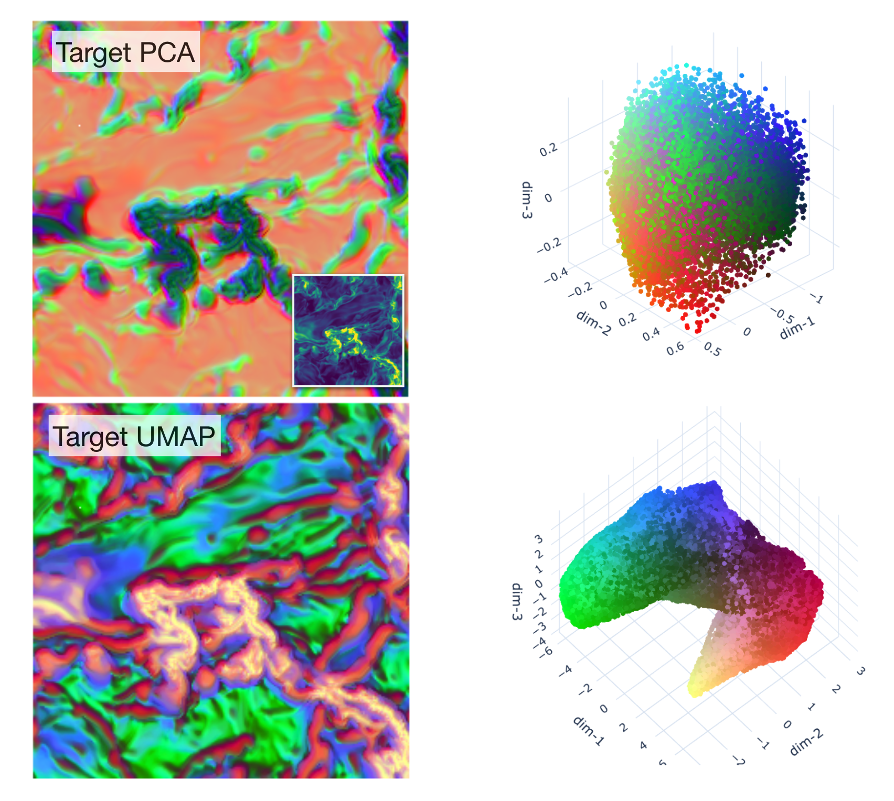

# `sajepa` — ScaleAware JEPA for Continuous Physical Fields

[](https://opensource.org/licenses/MIT)
[](https://www.python.org/)
[](https://pytorch.org/)
📧 **Contact:** [gxli.ai@proton.me](mailto:gxli.ai@proton.me) · [ligx.ngc7293@gmail.com](mailto:ligx.ngc7293@gmail.com)

`sajepa` is a PyTorch implementation of **ScaleAware JEPA**, a non-generative
self-supervised architecture that learns abstract latent representations of
continuous physical fields.

## 🏛️ Architecture

ScaleAware JEPA uses latent prediction rather than pixel reconstruction: a
joint-embedding predictive architecture that models continuous multi-scale
physical structures entirely in representation space:

- **Multi-Scale Spatial Aggregation:** Constrained Diffusion Decomposition (CDD)
  replaces fixed-grid masking with scale-aware, physics-informed spatial
  aggregation. Raw scalar inputs are decomposed into aligned fine-to-coarse
  components; the context-mask footprint is tied to each CDD diffusion scale,
  while the target patch remains fixed.
- **ConvNeXt-Driven Latent Coding:** Scale-aware CDD components feed directly
  into a modern ConvNeXt backbone (depthwise convolutions, inverted bottlenecks,
  GRN normalization) to produce dense 32-channel latent representations with the
  efficiency and expressivity required for high-resolution physical fields.

- **Dense Latent Coordinates:** The architecture produces a dense 32-channel
  latent vector at each spatial location, yielding a back-mappable latent atlas
  for downstream reasoning.
- **Modality Support:**
  - 2D fields: fully supported and tested.
  - 3D volumetric training (`3d_slab`): under active development.
  - Full-volume inference-only mode: available.

## 🎯 Representation Discovery & Domain Modeling

`sajepa` provides a foundation for unsupervised representation learning in
continuous 2D/3D environments where discrete semantic tokens do not exist. By
executing predictions entirely within a latent bottleneck, the model acts as
a dense latent encoder for continuous fields.

> **Abstract Concept Tracking Without Generation**
>
> Instead of training expensive generative models (Diffusion, VAEs) to
> synthesize noisy fields, `sajepa` focuses on representation alignment. This
> enables the discovery of complex physical morphologies — MHD density
> morphology, filamentary interfaces, and compact structures — from
> unlabelled scalar fields.

### 🌌 Dense Latent Atlas Projections

To verify that the scale-aware joint-embedding representations capture coherent
physical structures without manual labels, the dense 32-channel latent
coordinates are projected into a low-dimensional UMAP space. When back-mapped to
physical coordinates, these spaces organize continuous fields by their local
structural morphology.

| MHD Turbulence                                                          | NGC 3627                                                                                                                                        |
|:-----------------------------------------------------------------------:|:-----------------------------------------------------------------------------------------------------------------------------------------------:|
|                                                  |                                                                                                                     |
| UMAP and PCA projections for a continuous MHD plasma simulation.        | UMAP and PCA projections for the molecular gas intensity field of NGC 3627. Latent neighborhoods separate arm and interarm regions and recover a fainter diffuse interarm component. |

#### 🖥️ Interactive Dashboard — NGC 3627

Click-to-similarity inspection of spiral arm and interarm regions. Selecting a
latent neighborhood in the UMAP view back-maps to the corresponding physical
structure in the galaxy field.

```python
model.open_interactive_umap()                                          # Generates and opens browser interface
model.save_interactive_umap("predict_umap_xyz.npy", "out.html")      # Save to file
```


## ⚡ Installation

```bash
git clone https://github.com/gxli/SA-JEPA.git
cd sajepa
pip install -e .
```

**Apple Silicon (MPS) Note:** If you encounter missing operations on Apple GPUs,
configure your environment to use the native PyTorch fallback engine:

```bash
export PYTORCH_ENABLE_MPS_FALLBACK=1
```


## 🚀 Quick Start

### 🐍 Python API

```python
import numpy as np
import torch
from sajepa import ScaleAwareJEPA

# 1. Load any 2D scalar field (H, W)
arr = np.asarray(np.load("path/to/your_field.npy"), dtype=np.float32)
field = torch.from_numpy(arr)

# 2. Train a default scale-aware model
model = ScaleAwareJEPA()
model.fit(field, epochs=10, session_dir="outputs/my_run")

# 3. Extract the dense latent atlas → shape (C_latent, H, W)
latent = model.extract(field)

# 4. Generate dashboards from saved inference/embedding artifacts
model.generate_dashboard()                # → outputs/my_run/dashboard.html
umap_html = model.open_interactive_umap() # Generates and opens browser interface

# 5. Save everything
model.save_session("outputs/my_run")

print(f"Dashboard:     outputs/my_run/dashboard.html")
print(f"Interactive:   {umap_html}")
```

### ⚙️ Config-driven

> 📘 YAML configs can inherit from `base_pyramid_scaleaware_convnext.yaml` via
> `base_config`. The training CLI also merges the project base when a config
> omits `base_config`. See [Configuration Knobs Dictionary](configs/README.md)
> for the default set.

```python
from sajepa import ScaleAwareJEPA

model = ScaleAwareJEPA(config="configs/examples/mhd_example.yaml")
model.train(config_name="my_run", sessions_dir="outputs", dashboard=True)
model.open_interactive_umap()
model.save_session(model.session_dir)

print(f"Dashboard:     {model.session_dir}/dashboard.html")
print("Interactive UMAP is generated by model.open_interactive_umap().")
```

### 🔋 Cropped Field Training and Inference Mode

Set `data.crop_size` and `data.crop_mode` (e.g. `400`, `"random"`) to train on
crops when the full field would OOM. Inference always runs on the full field
with the EMA target encoder unmasked. See `configs/examples/masked_crop_blueprint.yaml`.

### ⌨️ Command Line

```bash
PYTHONPATH=. python scripts/train.py --config configs/base_pyramid_scaleaware_convnext.yaml --sessions-dir outputs
PYTHONPATH=. python scripts/session_to_dash.py --sessions-dir outputs --stage all
```

The dashboard is written inside each session directory. Run
`model.open_interactive_umap()` from Python to generate the optional interactive
UMAP view.

### 📊 Dashboard Output

After a run, `dashboard.html` can be generated from the saved session artifacts.
The click-to-similarity UMAP browser is generated only when explicitly requested.

| Path                                                              | Purpose                                                              |
|:------------------------------------------------------------------|:---------------------------------------------------------------------|
| `<outdir>/<session_name>/dashboard.html`                          | Plotly diagnostic dashboard (loss curves, latent projections, rank metrics) |
| `<outdir>/<session_name>/results/interactive_umap_predict.html`   | Optional click-to-similarity interactive UMAP browser                |

Reopen later:
```python
model = ScaleAwareJEPA.load_session("outputs/my_run")
model.open_dashboard()           # opens dashboard.html
model.open_interactive_umap()    # opens interactive UMAP
```

**Reloading & Continuing Workspaces**

```python
# Restore an existing saved model session
model = ScaleAwareJEPA.load_session("outputs/my_run")
latent = model.extract(field)

# WEIGHTS-ONLY SEED: Warm-start on new data using prior weights
model.fit(
    new_field,
    epochs=10,
    session_dir="outputs/refine_new_data",
    base_session="outputs/my_run",
    base_session_mode="weights",
)

# FULL CONTINUATION: Resume with optimizer, scaler, and epoch state
model.fit(
    new_field,
    epochs=30,
    session_dir="outputs/continue_old_run",
    base_session="outputs/my_run",
    base_session_mode="resume",
)
```

## 📂 Run Session Output Structure

Training sessions write a self-contained folder structure. The core artifacts
are normally written by completed runs; dashboard and embedding artifacts are
written when post-training artifact generation or the dashboard tools are run.

| File Path                                                                  | Artifact Contents                                                                                                                |
|:---------------------------------------------------------------------------|:---------------------------------------------------------------------------------------------------------------------------------|
| `<outdir>/<session_name>/model_last.pt`                                    | Latest saved system model weights file.                                                                                         |
| `<outdir>/<session_name>/checkpoint_last.pt`                               | Optimization states for complete session training recovery.                                                                      |
| `<outdir>/<session_name>/metrics.csv`                                      | Comprehensive training logging metrics (loss histories, LR schedules, rank properties).                                          |
| `<outdir>/<session_name>/dashboard.html`                                   | Self-contained Plotly diagnostic dashboard, generated from saved artifacts.                                                      |
| `<outdir>/<session_name>/results/predict_latent_vectors_full.npy`          | Dense computed coordinate latent atlas map array `(C, H, W)`, when embedding artifacts are generated.                            |
| `<outdir>/<session_name>/results/predict_pca_xyz.npy` / `predict_umap_xyz.npy` | PCA and UMAP coordinate maps, when embedding artifacts are generated. Invalid input/border/non-finite rows are saved as `NaN`, not repaired in the dashboard. |
| `scripts/local_scripts/flush_embedding.sh sessions/<name>`                 | Recalculate PCA/UMAP embedding artifacts from an existing fresh `inference_outputs.pt` and clear stale dashboard cache/html.     |

> **3D Volumetric UMAP:** Uses the full valid inferred slice/slab/volume extent,
> capped only by `train.umap.volumetric_max_points` (default `100000`). No
> default fraction sampling is applied.

> **CDD cache reproducibility:** CUDA and CPU CDD use different Gaussian
> smoothing implementations (PyTorch separable convolution vs. SciPy
> `ndimage.gaussian_filter`) and are not bit-identical. Session CDD cache
> metadata records the effective backend via `cdd_effective_use_gpu`; compare
> runs using the same backend when exact recovery numbers matter.

## ⚙️ Hyperparameter Knobs

> Config files should either declare `base_config` or be run through the
> training loader, which merges the project base before applying overrides.
> The exhaustive breakdown is in the
> [**Configuration Knobs Dictionary**](configs/README.md).

### Baseline Configuration:

**Training Settings**

- `epochs`: `10`
- `batch_size`: `4`
- `gradient_accumulation_steps`: `1`
- `gradient_accumulation_mode`: `step`

  $$B_{\text{eff}} = B \times G$$

  where $B$ is `batch_size` and $G$ is `gradient_accumulation_steps`.
  `step` preserves the classic microbatch gradient accumulation path; `batch`
  concatenates accumulated outputs and computes the loss once over the full
  accumulation window.
- The per-step token count for the JEPA loss and spread regularizer is
  $B \times N_{\text{targets}}$, where $N_{\text{targets}}$ is determined
  automatically from the image size and mask geometry.
- Optional target-region masks:
  - `data.target_mask`: path to a precomputed `.npy` valid-target map. Values
    `>0` allow target centers; `0` rejects them. The map is resized with
    nearest-neighbor if needed.
  - `data.target_threshold`: fallback valid-target map generated from raw data
    when `data.target_mask` is absent.
  These masks restrict target sampling and inference validity; they are not the
  same thing as saved JEPA mask footprint artifacts such as `target_mask_map`.
- **Optimization Details:** AdamW optimizer with cosine decay: base learning rate
  $1\times10^{-4}$, minimum $1\times10^{-6}$, 1-epoch linear warmup, weight decay
  $1\times10^{-5}$.
- **EMA Schedules:** Targets update along a cosine momentum schedule annealing
  from $0.99 \to 0.9999$ over the configured warmup fraction.

**Loss Components**

- `prediction_loss_weight`: `50` (primary JEPA latent prediction MSE multiplier).
- `spread_regularizer`: configured as `std_hinge`, with a scaling `weight: 2` (recommend `5` for typical use; see `configs/examples/mhd_example.yaml`), mapping against `target: context` inside a `"pooled"` spatial_mode.
- `symmetry_loss_weight`: `0.0` (off by default; set to `0.003` for weak four-view flip consistency).
- `normalize_loss_l2`: `false` (preserves exact latent spatial amplitude calculations).

**Large Fields & Crop Size**


**Modeling Dimensions**

- Latent width: `32` total dense channels.
- Encoder backbones: 4 sequenced ConvNeXt blocks using an internal base width configuration of `64`.
- Projector blocks: maps projections through a `32 → 96 → 32` bottleneck transformation.
- Predictor blocks: latent spatial translation layer tracking a default width of `96`.
- **Dilations** — `[1, 1, 1, 1]` standard; `[1, 1, 2, 4]` for larger fields.

  **Receptive Field Formula:**

  $$\mathrm{RF} = 1 + \sum_{i=1}^{D} (k - 1) \cdot d_i$$

  where $k$ is the encoder kernel size, $d_i$ the dilation at layer $i$, and
  $D$ the encoder depth.

  | Dilations | RF (k=7) |
  |---|---:|
  | `[1, 1, 1, 1]` | 25 px |
  | `[1, 1, 2, 4]` | 49 px |

  With GRN enabled the receptive field is global across the feature map.

 **Large Fields & Crop Size**

 For fields larger than $\sim 512^2$ px, GPU memory becomes the limiting
 factor. Training crops and inference tiling use different code paths:

 - Training: set `data.crop_size` and `data.crop_mode` in YAML.
   `data.crop_mode` supports `"none"` (default), `"random"`, and `"center"`.
   `data.crop_min_valid_fraction` applies to random crops.
 - Inference-only: use `model.infer_npy(..., crop_size=..., crop_mode="tile")`
   or `python -m src.inference_from_session ... --crop-mode tile` for sliding
   tiled inference and stitching.

For inference on an already-trained session, pass directly:
```python
model.infer_npy("large_field.npy", crop_size=256, crop_mode="tile")
```


## 💻 API Reference

| Python Method Interface           | Returns      | Purpose Description                                                                      |
|:----------------------------------|:-------------|:-----------------------------------------------------------------------------------------|
| `ScaleAwareJEPA(config=None)`     | model        | Initializes a pipeline from default settings, a dictionary, or configuration paths.      |
| `model.fit(field, epochs, ...)`   | self         | Executes training pipelines over a designated 2D physical target array.                  |
| `model.train(configs=None, ...)`  | self         | Orchestrates structured, YAML config-driven baseline training scenarios.                 |
| `model.extract(field)`            | `(C, H, W)`  | Generates the dense, pixel-registered coordinate latent array.                           |
| `model.project(field, method="umap")` | dict    | Computes PCA and best-effort UMAP via `torchdr`; returns PCA-only if UMAP is unavailable. |
| `model.infer_npy(path, **kwargs)` | string       | Runs direct automated forward passes on a target `.npy` layout file path.                |
| `model.analyze_rank()`            | dict         | Evaluates structural properties (effective manifold rank, dead channel screens).         |
| `model.save_session(path)`        | —            | Serializes all weight structures, evaluation dumps, and session configurations.          |
| `model.generate_dashboard(path=None)` | —         | Compiles an interactive visualization HTML file.                                         |
| `model.open_dashboard()`          | string       | Launches the active session's tracking dashboard directly inside a system browser.       |
| `model.open_interactive_umap()`   | string       | Launches an interactive click-to-similarity diagnostic UMAP session web tool.            |

## ⌨️ Command Line Utility & Diagnostics

```bash
# Execute structured multi-scale model training pipelines via terminal CLI profiles
PYTHONPATH=. python scripts/train.py --config configs/base_pyramid_scaleaware_convnext.yaml --sessions-dir sessions

# Audit active latent spaces to search for systemic channel collapse and calculate manifold summaries
python scripts/print_session_summary.py sessions/gen_*

# Launch your structural interactive Plotly analytics dashboard
PYTHONPATH=. python scripts/session_to_dash.py --sessions-dir sessions --stage all --export-dir results/dashboard

# Execute a sliding-window tiled inference workflow on very large out-of-core fields
python -m src.inference_from_session \
  --session sessions/mhd_run_01 \
  --input data/large_field.npy \
  --crop-size 256 \
  --crop-mode tile \
  --tta \
  --tta-mode flip4
```

## 📁 Repository Layout

<details><summary>Click to expand file tree</summary>

```text
.
├── configs/
│   └── base_pyramid_scaleaware_convnext.yaml   # Canonical training configuration profile
├── examples/
│   ├── quickstart.py                            # Basic programmatic entry validation script
│   ├── example_mhd_inline.py                    # Annotated script using inline variables
│   ├── example_config_driven.py                 # Config-override API training example
│   └── example_cli.sh                           # Shell example for CLI-driven runs
├── scripts/
│   ├── train.py                                 # Core training terminal application interface
│   ├── print_session_summary.py                 # Post-run evaluation summary calculator
│   ├── session_to_dash.py                       # Exporter script managing Plotly layouts
│   ├── session_to_movie.py                      # Converts saved movie frames into latent-space movies
│   └── session_to_plots.py                      # Exports static publication-ready vector figures
├── src/
│   ├── api.py                                   # Main developer ScaleAwareJEPA interface endpoint
│   ├── losses.py                                # Objective-loss configurations and spread metrics
│   ├── models/
│   │   ├── encoders.py                          # Scale-aware ConvNeXt structural backbones
│   │   ├── masking.py                           # Scale-informed matrix mask builders
│   │   └── predictor.py                         # Joint-Embedding spatial prediction layers
│   └── utils/
│       └── viz.py                               # Embedding artifact generation and plot helpers
└── tests/
```

</details>

## 📜 Citations & References

### ScaleAware-JEPA

```bibtex
@article{li2026scaleaware,
  author  = {Li, Guang-Xing},
  title   = {ScaleAware-{JEPA}: Latent Representation for Discovery in
             Multiscale Physical Fields},
  journal = {arXiv preprint},
  year    = {2026},
  note    = {arXiv:XXXX.XXXXX}
}
```

### Constrained Diffusion Decomposition

If you apply this Multi-Scale Constrained Diffusion Decomposition engine
within formal academic research pipelines, please attribute credit via the
citation record provided below:

```bibtex
@article{li2022constrained,
  author  = {Li, Guang-Xing},
  title   = {Multiscale decomposition of astronomical maps: A constrained diffusion method},
  journal = {The Astrophysical Journal Supplement Series},
  volume  = {259},
  number  = {2},
  pages   = {59},
  year    = {2022},
  doi     = {10.3847/1538-4365/ac4bc4}
}
```

## 📜 License

This package is open-source software distributed under the terms of the
MIT License.
